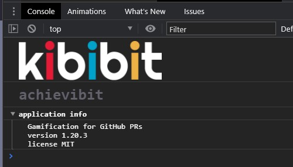

<p align="center">
  <a href="https://github.com/Kibibit/kb-steam-card/" target="blank">
  </a>
  <h2 align="center">
    @kibibit/consologo
  </h2>
</p>
<p align="center">
  <a href="https://www.npmjs.com/package/@kibibit/kb-steam-card"></a>
</p>
<p align="center">
  <!-- ALL-CONTRIBUTORS-BADGE:START - Do not remove or modify this section -->
<a href="#contributors-"></a>
<!-- ALL-CONTRIBUTORS-BADGE:END -->
</p>
<p align="center">
  Show a kibibit app name and info in the console.log
</p>
<hr>

**( Later, this might include all kind of logos for all kind of consoles... )**
## Installation
```
npm install --save @kibibit/consologo
```

## Usage
```javascript
import { consoleLogo } from '@kibibit/consologo';

console.logo('app name', `version ${ version }`);
```
or with an array of strings
```javascript
console.logo('app name', [
  `version ${ version }`,
  `license ${ license }`
]);
```

## Result


## Contributors ✨

Thanks goes to these wonderful people ([emoji key](https://allcontributors.org/docs/en/emoji-key)):

<!-- ALL-CONTRIBUTORS-LIST:START - Do not remove or modify this section -->
<!-- prettier-ignore-start -->
<!-- markdownlint-disable -->
<table>
  <tr>
    <td align="center"><a href="http://thatkookooguy.kibibit.io/"><br /><sub><b>Neil Kalman</b></sub></a><br /><a href="https://github.com/kibibit/consologo/commits?author=Thatkookooguy" title="Code">💻</a> <a href="https://github.com/kibibit/consologo/commits?author=Thatkookooguy" title="Documentation">📖</a> <a href="#design-Thatkookooguy" title="Design">🎨</a> <a href="#infra-Thatkookooguy" title="Infrastructure (Hosting, Build-Tools, etc)">🚇</a> <a href="#maintenance-Thatkookooguy" title="Maintenance">🚧</a></td>
  </tr>
</table>

<!-- markdownlint-restore -->
<!-- prettier-ignore-end -->

<!-- ALL-CONTRIBUTORS-LIST:END -->

This project follows the [all-contributors](https://github.com/all-contributors/all-contributors) specification. Contributions of any kind welcome!

## Stay in touch

- Author - [Neil Kalman](https://github.com/thatkookooguy)
- Website - [https://github.com/kibibit](https://github.com/kibibit)
- StackOverflow - [thatkookooguy](https://stackoverflow.com/users/1788884/thatkookooguy)
- Twitter - [@thatkookooguy](https://twitter.com/thatkookooguy)
- Twitter - [@kibibit_opensrc](https://twitter.com/kibibit_opensrc)
